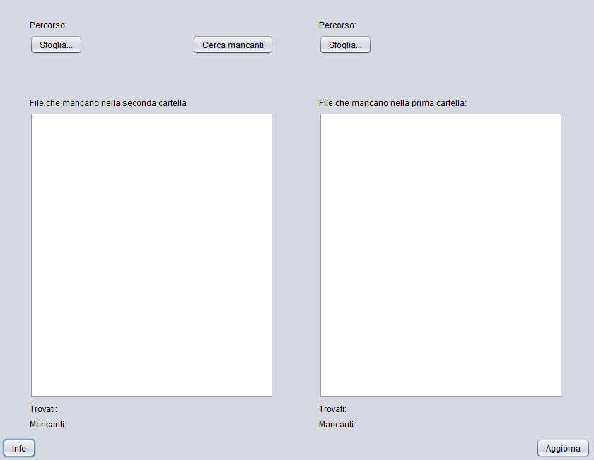

# QuickFinder: Rapid File Difference Comparison
This Java Swing application helps you quickly find differences between the files in two selected directories. It's especially handy when dealing with many files and you need to pinpoint what's missing or unique in each folder.

## Table of Contents
- [Features](#features)
- [How it Works](#how-it-works)
- [Technologies Used](#technologies-used)
- [Usage](#usage)
- [Screenshots](#screenshots)
      
## Features
* **Directory Selection**: Easily pick two different folders to compare.
* **Missing File Identification**: Instantly see which files are in one folder but not the other.
* **Intelligent Naming**: QuickFinder simplifies file names for comparison by ignoring file extensions (like `.txt`, `.jpg`) and anything before a hyphen (e.g., `01 - my_document.pdf` becomes `my_document`). This ensures more accurate comparisons even if file naming conventions vary slightly.
* **Numbered File Sequence Check**: A dedicated "Find Missing" button helps you spot gaps in sequentially numbered files within the *first* selected folder.
* **Real-time Updates**: The interface shows you the total number of files found and how many are missing from each selected directory.
* **User-Friendly Interface**: A simple and intuitive graphical interface built with Java Swing.

## How it Works
QuickFinder performs its magic by:
1.  Gathering the names of all files in the two chosen directories.
2.  Normalizing these names by stripping away file extensions and any text preceding a hyphen.
3.  Comparing these simplified lists to figure out which files are unique to each directory.
4.  For files with numbers in their names in the first directory, it checks for any missing numbers in the sequence.

## Technologies Used
* **Java Swing**: For creating the graphical user interface.
* **`java.io.File`**: Handles file system interactions and directory Browse.
* **`java.util.SortedSet` (specifically `TreeSet`)**: Used to store and sort file names efficiently, which helps in quick comparisons and automatically removes duplicates.
* **`javax.swing.JFileChooser`**: Enables easy directory selection by the user.
* **`javax.swing.JOptionPane`**: Displays informative messages and alerts to the user.

## Usage
1.  **Select Folder 1**: Click the "Browse..." button next to the first "Path:" label. Choose your first directory.
2.  **Select Folder 2**: Click the "Browse..." button next to the second "Path:" label and choose your second directory.
3.  **View Differences**: The text areas will automatically update, showing you the files that are present in one folder but missing from the other.
4.  **Refresh**: Click "Refresh" to re-scan the directories and update the comparison results.
5.  **Find Missing Numbered Files**: Click "Find Missing" to see a list of any missing numbers in a sequential file naming scheme within the *first* folder.
6.  **Information**: Click "Info" for a brief explanation of how the application works.

## Screenshots

